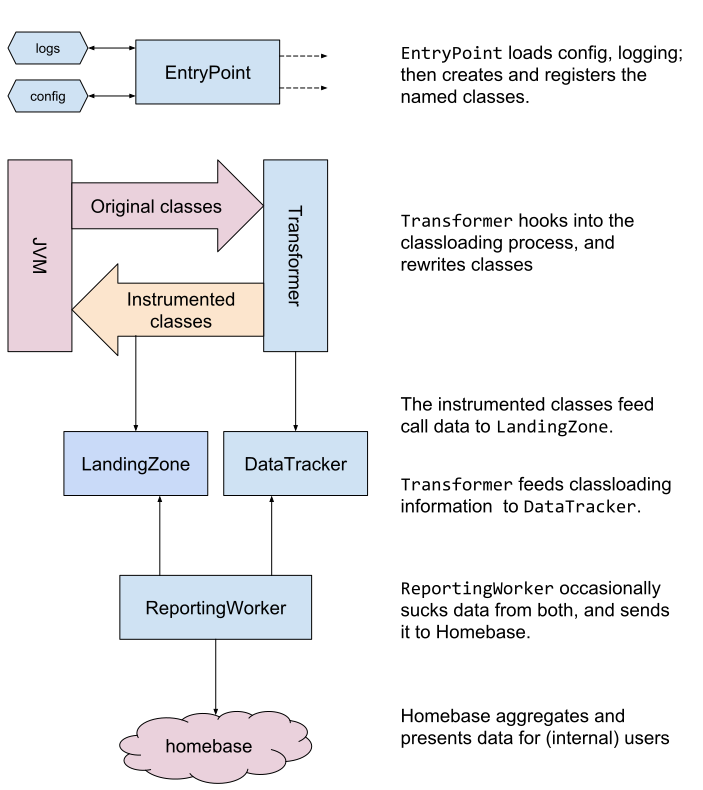

## java-runtime-agent

### Usage

Build is using `gradle`. You can use the wrapper, if you don't have `gradle`:

 * `./gradlew clean build` to do a full test and build.
 * `./gradlew test` to just run the unit tests.
 * `./gradlew distZip` to build a distribution.

Everything is a production build by default; there is no test/debug build.

The build outputs `build/libs/java-runtime-agent.jar`. This must be provided
to your victim JVM, as explained in [docs/starting.md](docs/starting.md).

Currently, we only test Java 8. Java 9-11 will give weird errors about
`illegal reflective access`.


### Example

If you have [java-goof](https://github.com/snyk/java-goof)
checked out in the current directory:

```bash
# build the runtime-agent
./gradlew build

# the runtime-agent reads the config file from `snyk-agent.properties` next to the library
echo 'projectId=cf257fa0-37f9-4690-a3fc-a71f0417ded6' > build/libs/snyk-agent.properties

# start goof, with the local runtime agent
(cd java-goof && MAVEN_OPTS="-javaagent:../build/libs/java-runtime-agent.jar" mvn tomcat7:run)
```

It should output something like:
```
...
...agent initialisation: loading config from: /foo/build/libs/snyk-agent.properties
...agent initialisation: switching logging to /foo/build/libs/snyk-logs/agent-1.33.7.log
```

From then on, all logging will be in the named file.
The tomcat startup should proceed as normal.


### Code layout

This is a really weird project. Here are the restrictions that caused that:

 * No libraries, so we don't pollute anyone else's classpath
 * Performance optimisations everywhere; static method calls, concurrent counters, etc.
 * Paranoia about many things; load order, etc.

Architecture overview:



This doesn't mention a couple of critical classes:

 * `UseCounter`: the performance-critical store (in `LandingZone`)
      of whether something is called
 * `ClassInfo`: `Transformer`'s helper for loading info about `.jar`s.

Every class should have at least a sentence explaining what it does,
in its documentation string.


### Other docs

There's a number of documents, many relate to the project:

 * [Monitoring introduction](docs/monitoring-introduction.md): An overview of
     how this type of monitoring works.
 * [Initial thoughts](docs/initial-thoughts.md): The initial analysis of
     the project specification.
 * [Performance](docs/performance.md): A (mostly historical) review of the
     performance development of this tool.
 * [Risks](docs/risks.md): Discusses the risks involved in this type of project,
     and how we specifically mitigate them.
 * [Starting](docs/starting.md) explains how to install the runtime-agent in
     different types of project.
 * Sample [events beacon](docs/example-beacon-events.json) and
    [metadata beacon](docs/example-beacon-meta.json) files, that
    homebase is consuming.